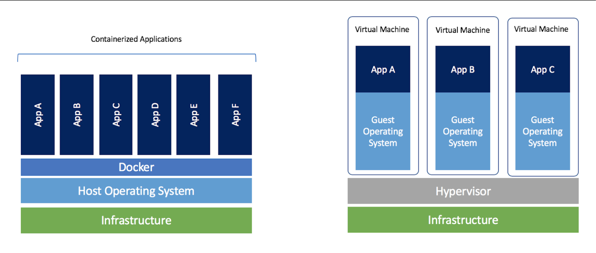
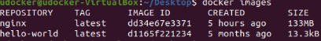
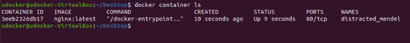
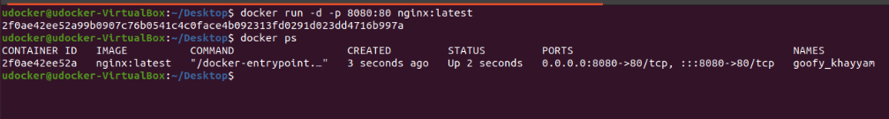
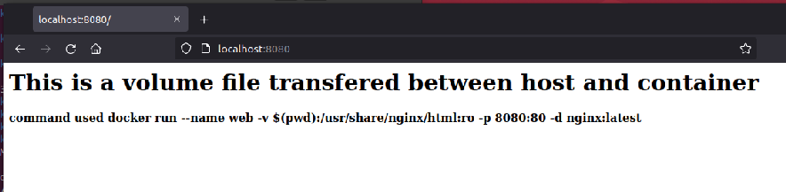
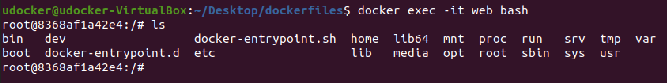

# Docker Nedir?

* İzole edilmiş bir ortamda uygulamalarımızı çalıştırabilmemizi sağlayan bir araçtır.
* Sanal makinalar ile benzer gibi gözükebilir fakat çok daha avantajlı bir araçtır. 
* Daha az memory kullanımı ve daha kolay entegrasyonu ile ön plana çıkmaktadır.

Docker bulunan tüm ortamlarda, herhangi bir dcoker ortamından alınan bir uygulama istenilen herhangi bir sistemde yine docker kullanılarak sorunsuz bir şekilde çalıştırılabilmektedir. Bu yüzden hızla gelişerek bir standart haline gelmiştir.


## CONTAINERS vs VIRTUAL MACHINES

Container'lar izole ve tüm işletim sistemine gerek duymadan çalışabilmektedirler. Sanal makinalarda ise durum farklıdır, her bir sanal makina bir işletim sisteminin kopyasını içermektedir. Dolayısı ile buradaki ana fark anlaşılmaktadır. Büyük bir memory usage kazancı, hiç docker kullanmamış birine bile bu şekilde kolayca ifade edilebilmektedir.



Docker Containers Adventages:

- Çok daha az memory
- Çok daha az disk alanı kullanımı
- Daha kısa sürede uygulamaların çalıştırılıp işleme koyulması
- Herhangi bir docker uygulamasını bir başka sistemdeki herhangi bir docker üzerinde sorunsuzca çalıştırmayı garanti etmesi.

## DOCKER IMAGES

Docker'ın temelini oluşturan image mantığını anlamak çok önemlidir. Konteynerlerin koşturacağı uygulamalar için baz aldığı tüm sistem ve dosyaları içermektedir ve bunların her biri bir Dockerfile ile yönetilmektedir. Dockerfile text dosyası gibi içeriğe sahip binary yapıda işlem yürütecek bir dosyadır. Bu bir standarttır.


Docker hub üzerinden test amaçlı image'ler pull komutu ile kendi docker ortamımıza çekilebilir. En popülerleri hello world ve nginx gibi image dosyalarıdır. [DockerHub](https://hub.docker.com/search?q=&type=image&image_filter=official)

---

> ``` docker pull nginx ```  

Artık elimizde bir image olduğuna göre container çalıştrma işlemine geçebiliriz.

Bunun için kullanılacak komut: 

> ``` docker run image:tag ```  

şeklinde olacaktır

Örnek: 
> ``` docker run nginx:latest ```  

Not: image'leri görmek için :

> ``` docker images ```  



---

Çalışan container'ları kontrol etmek :
> ``` docker container ls ```  
or 
> ``` docker ps ```



---

Detach modda docker container çalıştırma, bu sayede aynı terminalde işlemleri yürütmeye devam edebiliriz, container'ımız arkada çalışmaya devam edecektir.

> ``` docker run -d image:tag ```  

Daha önceki işlemleri takip etmek için log komutu kullanılabilir

> ``` docker logs ContainerID ```  

NOT: Yalnızca detach modda çalışanlar için kullanılabilir

Daha önceden çalıştırılmış olan bir container ID yardımı ile tekrar çalıştırılabilir.

> ``` docker start -a ContainerID ```  


Çalışıyor durumda olan bir container durdurmak için:
> ``` docker stop ContainerID/name ```  

docker kill ile ise ani bir sonlandırma yapılabilir.

Tamamını silmek için iki adım kullanılmalıdır.
Öncelikle elimizde olan commandlere bakalım 
> ``` docker ps --help ```

docker ps -aq ile sadece id'leri alabiliyoruz ve bunu bir şekilde docker rm komutu içine aktarmamız gerekmektedir. 

> ```docker rm $(docker ps -aq)```  

Hali hazırda çalışan bir container var ise -f force denenmelidir

Peki bu kayıt altına alınmış container loglarını silemez miyiz?

Silmek için: 

> ``` docker rm ContainerID/name ```  

Eğer çalışır durumda bile olsa force etmek için : 

> ``` docker rm -f ContainerID/name ```  

## PORT İŞLEMLERİ

Nginx üzerinden ilerleyeceğimiz için, nginx geliştiricileri tarafından default port olarak 80 numaralı container(bu önemli) portu üzerinden nginx web standart html sayfası-index üzerine yönlendirme yapmaktadır ve biz bu porta kendi bilgisayarımızdaki bir porta bağlayacağız böylelikle containerdan bir çıktı elde etmiş olacağız, eğer 8080 localhost portuna gidersek.

Host To Container Bağlantısı.
Komuta eklenmesi gereken : > ```-p 8080:80 ```
-p port bilgilerinin  girileceğini belirtir. İlk 8080 portu host yani bilgisayarımızın portu diğer port olan 80 ise container üzerindeki bağlanılacak port numarasıdır.

- MULTIPLE PORT

Docker aynı zamanda bir containerı farklı host portlarına bağlama imkanı da sunmaktadır. Aynı programı birçok farklı port üzerinde aynı anda çalıştırabiliriz. 

> ```docker run -d -p 8080:80 nginx:latest```

One line multiple port command : 

> ```docker run -d -p 8080:80 -p 7755:80 nginx:latest```

Container'a bir isim vermek

Docker containerları isimleri ile kontrol etmek ve yönetmek çok daha kolay olacağından en başından güzel bir isimlendirme yöntemi izlemek çok daha kullanışlı bir durum olacaktır.

> ``` docker run --name mycontainer -d -p 8080:80 nginx:latest ```



---
---

## VOLUMES

Volume'lar host makina ile container arasında veri paylaşımının yapılmasını sağlarlar. 
Ayrıca container'lar arası veri paylaşımı da yapılabilir.

Bunun için bir tane  web sayfası hazırlayarak nginx orjinal sayfasını değiştirmeye çalışacağız. Herhangi bir şey yazılabilir. Kaydedilen dizine gidildikten sonra yazılması gereken komut aşağıdaki gibidir.

> ``` docker run --name web -v $(pwd):/usr/share/nginx/html:ro -p 8080:80 -d nginx:latest ```

çıktısı ise: 



---

Bu işlemlerden sonra container ile host arasındaki belirlenen ortak paylaşım path'lerinden herhangi birinde bir dosya veya klasör değişikliği yapıldığında diğer tarftada senkronize olarak bu gerçekleşecektir. Docker'ın bir diğer güzel özelliklerindendir.

___NOT:___ Bi-directional transfer için container çalıştırılmadan önce :ro read-only komutu silinerek yeniden çalıştırılmalıdır

Şimdi container üzerinde bir dosya işlemi yapmaya çalışalım, bunun için öncelikle container terminaline girmemiz gerekmektedir.

> ``` docker exec -it web bash // web container ismimiz ```



Burada share klasörü ortak olan alan olarak belirlenmişti, oraya giriş yapılmalı.

 > ``` cd usr/share/nginx/html```
    ``` ls ```
    
ile bizim index dosyamızı görebiliriz.

> ``` touch fromcontainer.html  ``` 

ile yeni bir dosyayı her iki tarafta senkronize bir şekilde oluşturabilriz.

### Volumes part 2 - Volumes between containers

komut satırına bu kez eklenecek omut 
> ``` --volums-from containerName ```

> ```docker run --name web-two -d -p 3030:80 --volumes-from web nginx:latest```

---

## DOCKERFILE - Building our own images

### Dockerfile nedir?

Dockerfile C/C++ gibi dillerde sıklıkla kullanılan make file'a benzer yapıda bir dosyadır. Bu dosya sayesinde uygulamamız için gereken her şeyi adım adım belirleyip bir standarda bağlayarak kaydedebiliyoruz. Bundan sonrasında ise bu dockerfile sayesinde uygulamamız tüm docker ortamlarında sistemden bağımsız çalışabilir hale gelmektedir.

Adım adım işlemleri yazarken docker tarafından belirlenen birkaç sık kullanılan komutlar vardır. Bunlardan bazıları ___FROM, ADD, RUN, CMD, ENV___ gibi tüm bilgisayar ve yazılım mühendislerinin aşina olduğu komutlardır. ASlında genel yapı göz önünde bulundurulduğunda docker çalışma prensibi de bir class yapısını andırmaktadır. 

Sıradaki adımlarda nginx gibi hazır bir image üzerinden (zaten çoğunlukla hazır bri image üzerine inşaa etme işlemleri gerçekleştirilir ) basit bir docker file hazırlama adımlarını ve daha sonra makefile build eder gibi dockerfile build etme işlemlerini inceleyeceğiz.

__Örnek bir nginx dockerfile içeriği__

Burada önemli olan, zaten hali hazırda örnek bir website tasarımınızın olması ve bunu nginx üzerinden çalıştırmaktır. İnternet üzerinden free template'ler ile deneme yapılabilir. Kaynakta da bunun üzerinden ilerlemektedir. 

___FROM___ komutu ile bir image belirliyoruz. 
___ADD___ komutu ile source:destination olacak şekilde tüm image'a ait dosyaların dizinlerini belirtiyoruz. Bir web sitesinden image hazırlamak ve bir docker container'ında çalıştıtrımak aslında bu kadar basit.

--- 

___Dockerfile___

```
FROM nginx:latest
ADD . /usr/share/nginx/html
```

---

___Docker Build___

Build işlemi image'imizi build edecektir. Burada önemli adımlardan biri tag belirlemektir. Her imagein bir tagi ve name'i vardır. Bunları zaten yukarıdaki örneklerde sıkça kullanmıştık. Örneğin name:tag yani nginx:latest gibi. Daha sonrada Dockerfile'ımızın bulunduğu konumu ekliyoruz.
Örnek bir build komutu:

> ``` docker build --tag web:latest dosyaDizini```

---

Bir Machine Learning projesine ait Dockerfile yazılması adımlarını bu repodaki ml-docker-Sample-Project klasöründe inceleyebilirsiniz.

___Enes Çavuş - Docker Notes - Practices___

