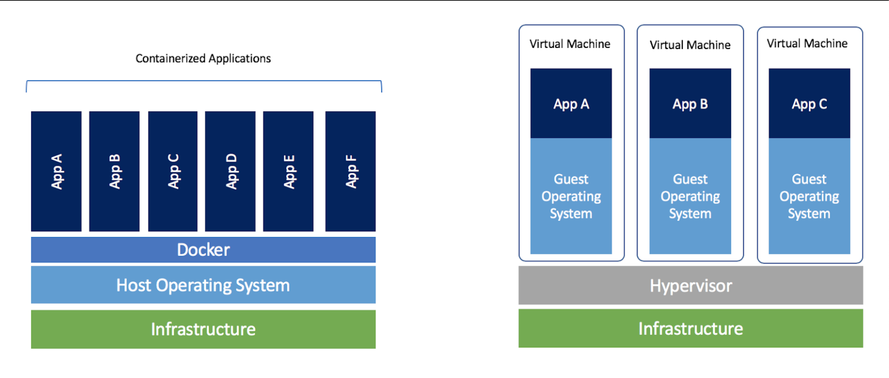

## Preview of Git and Docker Notes - Please check out each folder individually to see whole content 


### What you can find in this repo - Roadmap

1. [Python - 10+ more files with python practices](https://github.com/enescavus/Data-Science-Tech-Stack/tree/main/Python)
2. [SQL - creating, managing, deleting, updating, and more queries](https://github.com/enescavus/Data-Science-Tech-Stack/tree/main/SQL)
3. [Git](https://github.com/enescavus/Data-Science-Tech-Stack/tree/main/Git)
4. [Docker](https://github.com/enescavus/Data-Science-Tech-Stack/tree/main/Docker)

and more ...

---

# 1 - Git ve Github - Terminal Üzerinde Git İşlemleri, Komut Açıklamaları ve Pull Request

---

### Table of Contents
1. [Initialization & Local Repo Operations](#init)
2. [Branch (Dallanma)](#branch)
3. [Undoing in Git](#more)
4. [Pull Request - Open Source](#more)

---
    
### 1. Initialization & Local Repo Operations <a name="init"></a>

> ``` git init ```

Bu komut ile lokalde bir klasör veya dizinde ___git initialization___ işlemi gerçekleştiriyorz. Bundan sonra diğer git komutlarını rahatlıkla çalıştırabiliriz.

Daha sonra github lokal cihaz ile github hesabınız arasında bağlantı sağlanması gerekmektedir. [Connecting to Github](https://docs.github.com/en/github/authenticating-to-github/connecting-to-github-with-ssh)

> ``` git clone  repo link ```

Herhangi bir repoyu (pratik yapmak için tercihen kendinize ait bir repo) içinde bulunduğumuz dizine çekiyoruz.

Kodlar ya da proje dosyalarında bir değişiklik yaptıktan sonra bu değişiklikler güncellemeye hazır duruma getirilmelidir.

Değişiklik yapılmış dosyaları kontrol etmek için

> ``` git status ```

Bunları commit etmeye hazır hale getirmek için

> ``` git add .``` (tüm değişiklikler için .(nokta) ) - ( Sadece belirli değişiklileri commit sırasına almak için ise nokta yerine o dosyanın dizini örneğin sadece ReadME.md)

> ``` git commit -m “commit message” ```

Artık lokal üzerindeki adımlar tamamlandı, yapılan değişiklikler github server’larına aktarılmaya hazır.

 > ```git push -u origin master ``` (ssh bağlantısında bunu bir kez yazdıktan sonra sadece git push kullanarak aynı branch(master/main) üzerinde push işlemi gerçekleştirilebilir. )

---

### 2. Branch (Dallanma) <a name="branch"></a>

Github’ın en güzel özelliklerinden bir tanesi branch sistemidir. Üzerinde çalıştığınız bir projede önemli bir değişiklik yapmak istiyorsunuz ve bu değişiklik zaman alacak hatta birçok kodu etkileyecek, ekip arkadaşlarınızın bu süreçten etkilenmemesi için sadece kendinizin ya da küçük bir ekibin çalışacağı bir ortam yaratmak istiyorsunuz… 

İşte burada orjinal projenin bir kopyasını alarak farklı bir branch açıyorsunuz, burada istediğiniz kadar değişiklik yapın, push’layın, commit dizileri oluşturun vb., bunlar sadece bu branch üzerinde olacaktır. En sonunda istediğiniz değişiklik tamamlandığında main branch ile bu branch'in merge(birleştirme) işlemi gerçekleştirilebilir.

___NOT:___ bu komutlar lokal üzerinde tanımlanan branch’ler üzerinde kullanılmalıdır. Remote branch işlemleri için daha fazla detay -> [Remote Operations - Branches](https://www.atlassian.com/git/tutorials/using-branches)

Var olan branch’leri kontrol edin

> ``` git branch ```

Yeni bir branch oluşturun

> ``` git branch branch_name ```

Bulunduğunuz branch’i değiştirin 

> ``` git checkout branch_name ```

Branch silin

> ``` git branch -d branch_name ```

Değişiklikleri remote branch’e push

> ``` git push origin branch_name ```

İki branch’i birleştirme

> ``` git merge (source branch) (target branch) ```
<a name="more"></a>
    
### [Read More - Unoding in Git - Pull Request - Open Source](https://github.com/enescavus/Data-Science-Tech-Stack/tree/main/Git) 

---

## 2 - DOCKER

### Table of Contents
1. [Docker Nedir?](#nedir)
2. [Docker Images](#images)
3. [Port İşlemleri](#more2)
4. [Volumes](#more2)
5. [Dockerfile](#more2)


---


# Docker Nedir? <a name="nedir"></a>

* İzole edilmiş bir ortamda uygulamalarımızı çalıştırabilmemizi sağlayan bir araçtır.
* Sanal makinalar ile benzer gibi gözükebilir fakat çok daha avantajlı bir araçtır. 
* Daha az memory kullanımı ve daha kolay entegrasyonu ile ön plana çıkmaktadır.

Docker bulunan tüm ortamlarda, herhangi bir dcoker ortamından alınan bir uygulama istenilen herhangi bir sistemde yine docker kullanılarak sorunsuz bir şekilde çalıştırılabilmektedir. Bu yüzden hızla gelişerek bir standart haline gelmiştir.


## CONTAINERS vs VIRTUAL MACHINES

Container'lar izole ve tüm işletim sistemine gerek duymadan çalışabilmektedirler. Sanal makinalarda ise durum farklıdır, her bir sanal makina bir işletim sisteminin kopyasını içermektedir. Dolayısı ile buradaki ana fark anlaşılmaktadır. Büyük bir memory usage kazancı, hiç docker kullanmamış birine bile bu şekilde kolayca ifade edilebilmektedir.



Docker Containers Adventages:

- Çok daha az memory
- Çok daha az disk alanı kullanımı
- Daha kısa sürede uygulamaların çalıştırılıp işleme koyulması
- Herhangi bir docker uygulamasını bir başka sistemdeki herhangi bir docker üzerinde sorunsuzca çalıştırmayı garanti etmesi.

## DOCKER IMAGES <a name="images"></a>

Docker'ın temelini oluşturan image mantığını anlamak çok önemlidir. Konteynerlerin koşturacağı uygulamalar için baz aldığı tüm sistem ve dosyaları içermektedir ve bunların her biri bir Dockerfile ile yönetilmektedir. Dockerfile text dosyası gibi içeriğe sahip binary yapıda işlem yürütecek bir dosyadır. Bu bir standarttır.


Docker hub üzerinden test amaçlı image'ler pull komutu ile kendi docker ortamımıza çekilebilir. En popülerleri hello world ve nginx gibi image dosyalarıdır. [DockerHub](https://hub.docker.com/search?q=&type=image&image_filter=official)

---

> ``` docker pull nginx ```  

Artık elimizde bir image olduğuna göre container çalıştrma işlemine geçebiliriz.

Bunun için kullanılacak komut: 

> ``` docker run image:tag ```  

şeklinde olacaktır

Örnek: 
> ``` docker run nginx:latest ```  

Not: image'leri görmek için :

> ``` docker images ```  


---

Çalışan container'ları kontrol etmek :
> ``` docker container ls ```  
or 
> ``` docker ps ```


---

Detach modda docker container çalıştırma, bu sayede aynı terminalde işlemleri yürütmeye devam edebiliriz, container'ımız arkada çalışmaya devam edecektir.

> ``` docker run -d image:tag ```  

Daha önceki işlemleri takip etmek için log komutu kullanılabilir

> ``` docker logs ContainerID ```  

NOT: Yalnızca detach modda çalışanlar için kullanılabilir

Daha önceden çalıştırılmış olan bir container ID yardımı ile tekrar çalıştırılabilir.

> ``` docker start -a ContainerID ```  


Çalışıyor durumda olan bir container durdurmak için:
> ``` docker stop ContainerID/name ```  

docker kill ile ise ani bir sonlandırma yapılabilir.

Tamamını silmek için iki adım kullanılmalıdır.
Öncelikle elimizde olan commandlere bakalım 
> ``` docker ps --help ```

docker ps -aq ile sadece id'leri alabiliyoruz ve bunu bir şekilde docker rm komutu içine aktarmamız gerekmektedir. 

> ```docker rm $(docker ps -aq)```  

Hali hazırda çalışan bir container var ise -f force denenmelidir

Peki bu kayıt altına alınmış container loglarını silemez miyiz?

Silmek için: 

> ``` docker rm ContainerID/name ```  

Eğer çalışır durumda bile olsa force etmek için : 

> ``` docker rm -f ContainerID/name ```  

## PORT İŞLEMLERİ

Nginx üzerinden ilerleyeceğimiz için, nginx geliştiricileri tarafından default port olarak 80 numaralı container(bu önemli) portu üzerinden nginx web standart html sayfası-index üzerine yönlendirme yapmaktadır ve biz bu porta kendi bilgisayarımızdaki bir porta bağlayacağız böylelikle containerdan bir çıktı elde etmiş olacağız, eğer 8080 localhost portuna gidersek.

Host To Container Bağlantısı.
Komuta eklenmesi gereken : > ```-p 8080:80 ```
-p port bilgilerinin  girileceğini belirtir. İlk 8080 portu host yani bilgisayarımızın portu diğer port olan 80 ise container üzerindeki bağlanılacak port numarasıdır.

- MULTIPLE PORT

Docker aynı zamanda bir containerı farklı host portlarına bağlama imkanı da sunmaktadır. Aynı programı birçok farklı port üzerinde aynı anda çalıştırabiliriz. 

> ```docker run -d -p 8080:80 nginx:latest```

One line multiple port command : 

> ```docker run -d -p 8080:80 -p 7755:80 nginx:latest```

Container'a bir isim vermek

Docker containerları isimleri ile kontrol etmek ve yönetmek çok daha kolay olacağından en başından güzel bir isimlendirme yöntemi izlemek çok daha kullanışlı bir durum olacaktır.

> ``` docker run --name mycontainer -d -p 8080:80 nginx:latest ```


---
---
<a name="more2"></a>

### [Read More - Port İşlemleri - Volums - Dockerfile](https://github.com/enescavus/Data-Science-Tech-Stack/tree/main/Docker) 


___ENES ÇAVUŞ - Tech Stack for Data Science___

___Contact :___ [LinkedIn](https://www.linkedin.com/in/enes-cavus)